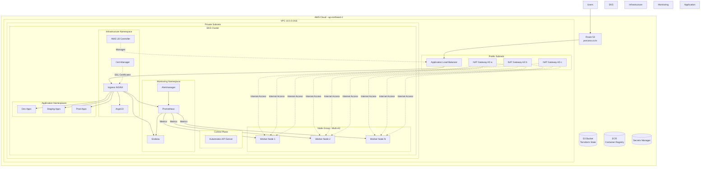
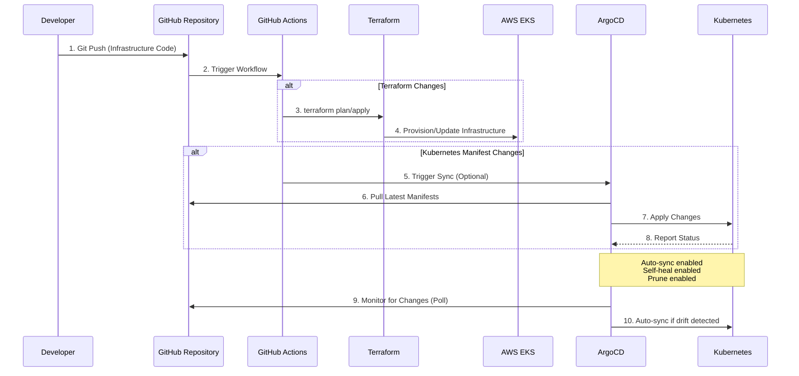
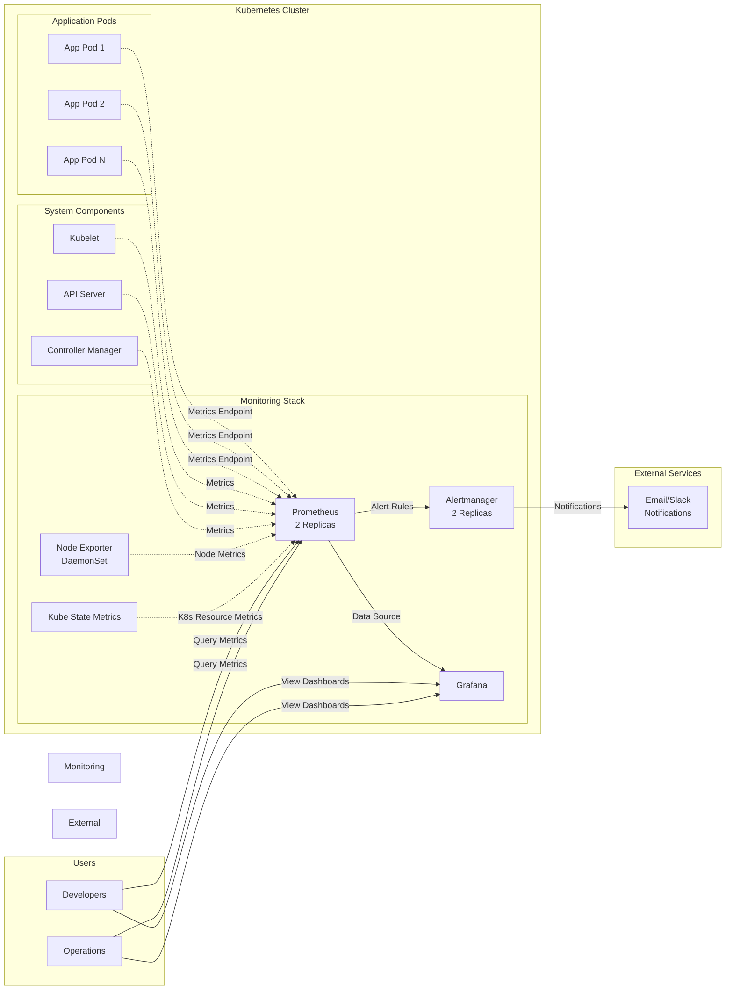
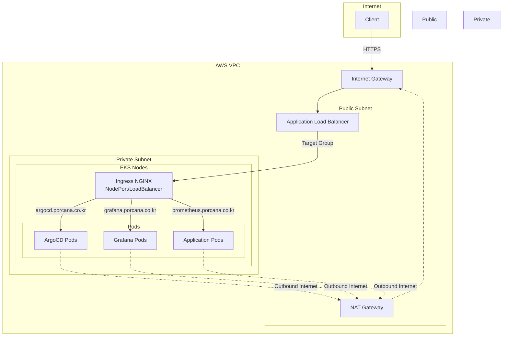

# AWS EKS with GitOps (ArgoCD)

프로덕션 레벨의 AWS EKS 클러스터를 Terraform과 GitOps(ArgoCD)로 관리하는 완전한 인프라 코드입니다.

## 특징

### Terraform 인프라
- **EKS 클러스터**: 최신 Kubernetes 버전
- **완전한 VPC 네트워킹**: 퍼블릭/프라이빗 서브넷, Multi-AZ
- **관리형 노드 그룹**: Auto Scaling, 보안 강화
- **필수 EKS 애드온**: VPC CNI, CoreDNS, kube-proxy, EBS CSI Driver

### GitOps (ArgoCD)
- **App of Apps 패턴**: 모든 애플리케이션을 선언적으로 관리
- **환경 분리**: dev, staging, prod namespace 분리
- **자동 동기화**: Git push 시 자동 배포

### 인프라 도구 (클러스터 전역)
- **ArgoCD**: GitOps CD 플랫폼
- **Ingress NGINX**: Ingress Controller
- **Cert-Manager**: 자동 SSL/TLS 인증서 관리
- **AWS Load Balancer Controller**: ALB/NLB 통합
- **Prometheus + Grafana**: 모니터링 및 메트릭
- **Alertmanager**: 알림 관리

### CI/CD
- **GitHub Actions**: Terraform 관리 및 ArgoCD 동기화
- **자동화된 검증**: Manifest 검증, Terraform plan

## 아키텍처

### 전체 인프라 구조



### GitOps 워크플로우



### 모니터링 아키텍처



### 네트워크 플로우



## 프로젝트 구조

```
aws_terraform/
├── terraform/                              # Terraform 인프라 코드
│   ├── versions.tf                         # Provider 설정
│   ├── vpc.tf                              # VPC 리소스
│   ├── eks.tf                              # EKS 클러스터
│   ├── node-groups.tf                      # 노드 그룹
│   ├── iam.tf                              # IAM 역할/정책
│   ├── addons.tf                           # EKS 애드온
│   ├── variables.tf                        # 변수 정의
│   ├── outputs.tf                          # 출력 값
│   └── terraform.tfvars.example            # 변수 예제
│
├── kubernetes/                             # Kubernetes 매니페스트
│   ├── base/                               # 기본 리소스
│   │   └── namespaces/                     # dev, staging, prod
│   │
│   ├── infrastructure/                     # 인프라 도구 (클러스터 전역)
│   │   ├── argocd/                         # ArgoCD 설치
│   │   ├── monitoring/                     # Prometheus + Grafana
│   │   ├── ingress-nginx/                  # Ingress Controller
│   │   ├── cert-manager/                   # 인증서 관리
│   │   └── aws-load-balancer-controller/   # AWS LB Controller
│   │
│   └── applications/                       # 애플리케이션
│       ├── argocd-apps/                    # ArgoCD Application 정의
│       │   ├── app-of-apps.yaml            # 루트 애플리케이션
│       │   ├── infrastructure.yaml         # 인프라 앱
│       │   ├── dev-apps.yaml               # Dev 환경
│       │   ├── staging-apps.yaml           # Staging 환경
│       │   └── prod-apps.yaml              # Prod 환경
│       │
│       └── overlays/                       # 환경별 설정 (Kustomize)
│           ├── dev/
│           ├── staging/
│           └── prod/
│
├── .github/
│   └── workflows/                          # GitHub Actions
│       ├── terraform.yml                   # Terraform plan/apply
│       ├── argocd-sync.yml                 # ArgoCD 동기화
│       └── validate-manifests.yml          # Manifest 검증
│
├── docs/                                   # 문서
│   ├── SETUP.md                            # 초기 설정 가이드
│   ├── ARGOCD.md                           # ArgoCD 사용 가이드
│   └── MONITORING.md                       # 모니터링 가이드
│
└── README.md                               # 이 파일
```

## 빠른 시작

### 사전 요구사항

- **AWS CLI**: 최신 버전 설치 및 구성
- **Terraform**: >= 1.0
- **kubectl**: >= 1.28
- **helm**: >= 3.0
- **Git**: 버전 관리

### 1. Terraform으로 EKS 클러스터 생성

```bash
cd terraform

# S3 백엔드 설정 (권장)
# 1. S3 버킷 생성 (한 번만 실행)
aws s3 mb s3://your-terraform-state-bucket --region ap-northeast-2
aws s3api put-bucket-versioning \
  --bucket your-terraform-state-bucket \
  --versioning-configuration Status=Enabled
aws s3api put-bucket-encryption \
  --bucket your-terraform-state-bucket \
  --server-side-encryption-configuration '{
    "Rules": [{
      "ApplyServerSideEncryptionByDefault": {
        "SSEAlgorithm": "AES256"
      }
    }]
  }'

# 2. 백엔드 설정 파일 생성
cp backend.hcl.example backend.hcl
# backend.hcl 편집 (버킷 이름 업데이트)
vi backend.hcl

# 변수 파일 생성
cp terraform.tfvars.example terraform.tfvars
# terraform.tfvars 편집 (cluster_name 필수)
vi terraform.tfvars

# Terraform 실행
terraform init -backend-config=backend.hcl
terraform plan
terraform apply

# kubectl 설정
aws eks update-kubeconfig --region ap-northeast-2 --name <cluster-name>
kubectl get nodes
```

### 2. ArgoCD 설치 (Bootstrap)

```bash
# ArgoCD만 수동으로 설치 (Bootstrap)
kubectl apply -k kubernetes/infrastructure/argocd/
kubectl wait --for=condition=Available --timeout=300s deployment/argocd-server -n argocd

# ArgoCD 초기 비밀번호 확인
kubectl -n argocd get secret argocd-initial-admin-secret -o jsonpath="{.data.password}" | base64 -d
echo

# ArgoCD UI 접속 방법 1: 포트 포워딩 (로컬 테스트)
kubectl port-forward svc/argocd-server -n argocd 8080:443
# 브라우저에서 https://localhost:8080 접속

# ArgoCD UI 접속 방법 2: Ingress를 통한 접속 (프로덕션)
# Ingress가 배포된 후 https://argocd.porcana.co.kr 접속
# Username: admin
# Password: 위에서 확인한 비밀번호
```

### 3. GitOps 설정

```bash
# 1. GitHub 저장소에 코드 푸시
git add .
git commit -m "Initial infrastructure setup"
git push origin main

# 2. ArgoCD Application 파일에서 GitHub 저장소 URL 업데이트
# 다음 파일들을 편집하세요:
# - kubernetes/applications/argocd-apps/app-of-apps.yaml
# - kubernetes/applications/argocd-apps/infrastructure.yaml
# 'YOUR-ORG/YOUR-REPO'를 실제 저장소로 변경

# 3. App of Apps 배포 (나머지는 자동으로 설치됨)
kubectl apply -f kubernetes/applications/argocd-apps/app-of-apps.yaml

# 4. ArgoCD가 자동으로 모든 infrastructure 설치
# - Namespaces
# - Cert-Manager
# - Ingress NGINX
# - AWS Load Balancer Controller
# - Monitoring (Prometheus + Grafana + Alertmanager)

# 5. 설치 진행 상황 확인
kubectl get applications -n argocd
argocd app list
argocd app get app-of-apps

# 6. 모든 파드가 준비될 때까지 대기
kubectl get pods -n cert-manager
kubectl get pods -n ingress-nginx
kubectl get pods -n kube-system | grep aws-load-balancer
kubectl get pods -n monitoring
```

**중요 설정 변경 사항:**

1. **AWS Load Balancer Controller** (`kubernetes/infrastructure/aws-load-balancer-controller/values.yaml`):
   - `clusterName`: EKS 클러스터 이름으로 변경
   - `serviceAccount.annotations.eks.amazonaws.com/role-arn`: Terraform output에서 가져온 IAM Role ARN으로 변경

2. **Monitoring** (`kubernetes/infrastructure/monitoring/values.yaml`):
   - Ingress 도메인 변경 (prometheus.example.com, grafana.example.com 등)
   - Grafana admin 비밀번호 변경

3. **Ingress NGINX** (`kubernetes/infrastructure/ingress-nginx/values.yaml`):
   - 필요시 replica count나 리소스 조정
```

### 4. GitHub Actions 설정

GitHub 저장소 Settings > Secrets에 다음 시크릿 추가:

- `AWS_ACCESS_KEY_ID`: AWS 액세스 키
- `AWS_SECRET_ACCESS_KEY`: AWS 시크릿 키
- `CLUSTER_NAME`: EKS 클러스터 이름
- `ARGOCD_SERVER`: ArgoCD 서버 주소
- `ARGOCD_TOKEN`: ArgoCD 인증 토큰

### 5. DNS 설정 (Route 53)

**필수: 다음 도메인들을 ALB 주소로 연결해야 합니다.**

```bash
# 1. ALB DNS 주소 확인
kubectl get svc -n ingress-nginx ingress-nginx-controller -o jsonpath='{.status.loadBalancer.ingress[0].hostname}'

# 예시 출력:
# a1b2c3d4e5f6g7h8-1234567890.ap-northeast-2.elb.amazonaws.com

# 2. Route 53에서 A 레코드 (Alias) 추가
# - argocd.porcana.co.kr → ALB
# - grafana.porcana.co.kr → ALB
# - prometheus.porcana.co.kr → ALB
# - alertmanager.porcana.co.kr → ALB
```

**Route 53 설정 (AWS Console):**

1. Route 53 > Hosted Zones > `porcana.co.kr` 선택
2. "Create record" 클릭
3. 각 서브도메인에 대해:
   - Record name: `argocd`, `grafana`, `prometheus`, `alertmanager`
   - Record type: `A`
   - Alias: `Yes`
   - Route traffic to: `Alias to Application and Classic Load Balancer`
   - Region: `ap-northeast-2`
   - Load Balancer: 위에서 확인한 ALB 선택

**SSL 인증서 확인:**

```bash
# Cert-Manager가 자동으로 Let's Encrypt 인증서를 발급합니다
kubectl get certificate -A

# 인증서가 Ready 상태인지 확인
kubectl describe certificate -n argocd argocd-server-tls
kubectl describe certificate -n monitoring grafana-tls
kubectl describe certificate -n monitoring prometheus-tls
kubectl describe certificate -n monitoring alertmanager-tls
```

**접속 확인:**

```bash
# 도메인으로 접속 테스트
curl -I https://argocd.porcana.co.kr
curl -I https://grafana.porcana.co.kr
curl -I https://prometheus.porcana.co.kr
curl -I https://alertmanager.porcana.co.kr

# 브라우저에서 접속
# - https://argocd.porcana.co.kr
# - https://grafana.porcana.co.kr
# - https://prometheus.porcana.co.kr
# - https://alertmanager.porcana.co.kr
```

## 환경별 배포

### Dev 환경
```bash
# dev namespace에 애플리케이션 배포
# kubernetes/applications/overlays/dev/ 에 매니페스트 추가
# Git push하면 ArgoCD가 자동 동기화
```

### Staging 환경
```bash
# staging namespace에 배포
# kubernetes/applications/overlays/staging/ 에 매니페스트 추가
```

### Production 환경
```bash
# prod namespace에 배포
# ArgoCD에서 수동 승인 필요 (자동 동기화 꺼짐)
```

## 모니터링

### Grafana 관리자 비밀번호 설정

**방법 1: Kubernetes Secret 사용 (권장)**

```bash
# 1. Secret 생성
kubectl create secret generic grafana-admin-password \
  -n monitoring \
  --from-literal=admin-user=admin \
  --from-literal=admin-password=YOUR_SECURE_PASSWORD

# 2. values.yaml에서 existingSecret 설정이 되어있는지 확인
# grafana.admin.existingSecret: "grafana-admin-password"

# 3. ArgoCD로 배포하면 자동으로 Secret 참조
```

**방법 2: Secret 매니페스트 파일 사용**

```bash
# 1. Example 파일 복사
cp kubernetes/infrastructure/monitoring/grafana-secret.yaml.example \
   kubernetes/infrastructure/monitoring/grafana-secret.yaml

# 2. 비밀번호를 Base64로 인코딩
echo -n "YOUR_SECURE_PASSWORD" | base64

# 3. grafana-secret.yaml 파일에서 admin-password 값 변경

# 4. Secret 생성
kubectl apply -f kubernetes/infrastructure/monitoring/grafana-secret.yaml

# Note: grafana-secret.yaml은 .gitignore에 포함되어 Git에 커밋되지 않습니다
```

**방법 3: 직접 비밀번호 설정 (간단하지만 덜 안전)**

```bash
# values.yaml에서 adminPassword 직접 설정 (existingSecret 주석 처리)
# grafana:
#   adminPassword: "YOUR_SECURE_PASSWORD"
```

### Grafana 접속
```bash
# 방법 1: 포트 포워딩 (로컬 테스트)
kubectl port-forward -n monitoring svc/prometheus-grafana 3000:80
# 브라우저에서 http://localhost:3000 접속

# 방법 2: Ingress를 통한 접속 (프로덕션)
# https://grafana.porcana.co.kr
# Username: admin
# Password: Secret에 설정한 비밀번호
```

### Prometheus 접속
```bash
kubectl port-forward -n monitoring svc/prometheus-kube-prometheus-prometheus 9090:9090
# http://localhost:9090
```

### AlertManager 접속
```bash
kubectl port-forward -n monitoring svc/prometheus-kube-prometheus-alertmanager 9093:9093
# http://localhost:9093
```

## 주요 명령어

### ArgoCD
```bash
# 애플리케이션 목록
argocd app list

# 애플리케이션 상태 확인
argocd app get <app-name>

# 수동 동기화
argocd app sync <app-name>

# 롤백
argocd app rollback <app-name>
```

### Terraform
```bash
# Plan 확인
cd terraform && terraform plan

# 인프라 변경 적용
terraform apply

# 리소스 삭제
terraform destroy
```

### kubectl
```bash
# 네임스페이스별 리소스 확인
kubectl get all -n dev
kubectl get all -n staging
kubectl get all -n prod

# 로그 확인
kubectl logs -n <namespace> <pod-name>

# Pod 접속
kubectl exec -it -n <namespace> <pod-name> -- /bin/sh
```

## 문제 해결

### ArgoCD 애플리케이션이 동기화되지 않음
```bash
# ArgoCD 로그 확인
kubectl logs -n argocd deployment/argocd-application-controller

# 수동 동기화 시도
argocd app sync <app-name> --force
```

### Ingress가 작동하지 않음
```bash
# Ingress Controller 로그 확인
kubectl logs -n ingress-nginx deployment/ingress-nginx-controller

# LoadBalancer 서비스 확인
kubectl get svc -n ingress-nginx
```

### 모니터링 데이터가 보이지 않음
```bash
# Prometheus targets 확인
# http://localhost:9090/targets

# ServiceMonitor 확인
kubectl get servicemonitor -A
```

## 보안 고려사항

1. **Terraform State 보안**
   - S3 백엔드 사용 (encryption 활성화)
   - DynamoDB로 state lock

2. **Secrets 관리**
   - External Secrets Operator 사용 고려
   - AWS Secrets Manager 통합

3. **네트워크 보안**
   - Private endpoint 사용
   - Network Policy 설정

4. **인증/인가**
   - RBAC 적절히 설정
   - Pod Security Standards

## 비용 최적화

- **Spot 인스턴스**: 개발 환경에서 사용
- **NAT Gateway**: 단일 NAT Gateway로 축소 가능
- **Auto Scaling**: 적절한 min/max 설정
- **모니터링 데이터 보관 기간**: 30일 → 7일

## 기여

이슈나 풀 리퀘스트를 환영합니다.

## 라이선스

MIT License

## 참고 문서

- [상세 설정 가이드](docs/SETUP.md)
- [ArgoCD 사용 가이드](docs/ARGOCD.md)
- [모니터링 가이드](docs/MONITORING.md)